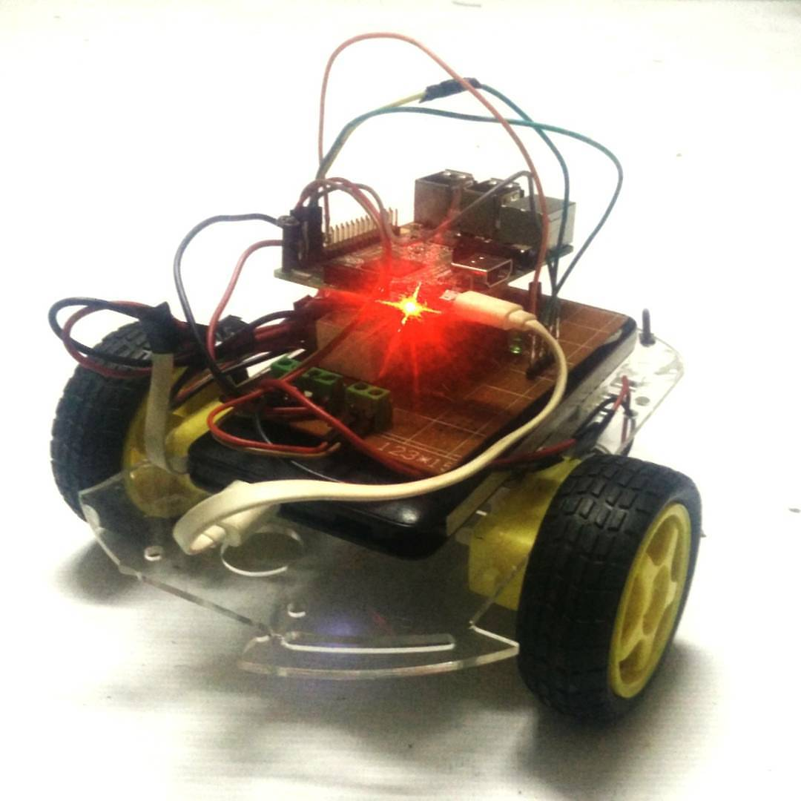
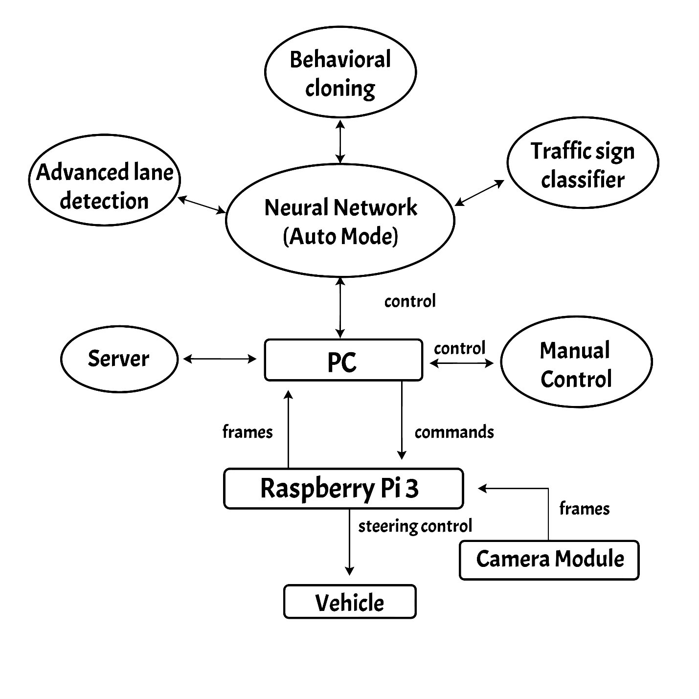
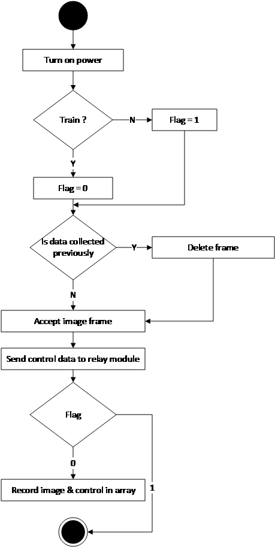
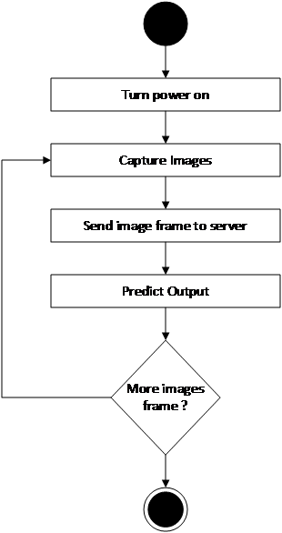

# Self Driving RC Car

Self Driving RC Car based on Neural Network & Raspberry Pi



## Table of Contents

- [Introduction](#introduction)
- [Development Approach](#development-approach)
  - [Hardware Development](#hardware-development)
  - [Software Development and Functioning](#software-development-and-functioning)
- [Methodology](#methodology)
  - [Processing unit](#processing-unit)
  - [Control unit](#control-unit)
  - [Neural Network](#neural-network)
  - [Object detection](#object-detection)
  - [Remote motor control with Raspberry PI 3](#Remote-motor-control-with-Raspberry-PI-3)
- [Technical Requirements](#technical-requirements)
  - [Hardware](#hardware)
  - [Software](#software)
- [Usage](#usage)
  - [Training Mode](#training-mode)
  - [Self Driving Mode](#self-driving-car)
- [Block Diagram](#block-diagram)
- [Activity Diagram](#activity-diagram)
- [Algorithm](#algorithm)
- [LICENCE](#licence)

## Introduction

This project implements autonomous driving feature to a remote-controlled car for improved safety concern. The main purpose of this project is to demonstrate the usability of artificial intelligence in the field of transportation and to demonstrate the concept of machine learning and neural networking. With the completion of this project we have properly demonstrated the usability of this technology in the near future and also demonstrate how this capitalizes on the user safety.

The study proposed development of an autonomous vehicle, meaning it doesn’t require a driver to drive to the required destination. It makes the optimal use of the digital map and is trained with the help of plenty of data. After the selection of the destination by the user, the vehicle is able to select the shortest route to the destination or drive by any route requested by the user. This eliminates the need of a chauffeur for those who doesn’t know how to drive and alongside establishes the factor of security as the vehicle is able to detect any obstacles in its way thus able to avoid any incoming threat to the passenger with the help of various sensors built onto it.

## Development Approach

The development of our project has been conducted in two phases hardware and software. Utilizing the limited resources, we were supplied with, we managed to assemble the minimal hardware components needed to make our project run.

#### Hardware Development

The primary component needed in our Self-Driving Car is the Raspberry Pi 3. It controls the motors driving the car itself and with its powerful processor analyzes the image stream supplied by the Pi Camera and then decides on how the car should operate on the required conditions.
The Raspberry Pi is connected with a custom-built relay module though which it drives the motors of the car. It is powered with the help of portable power bank which is attached to the car itself. The Raspberry Pi in turn provides the necessary logic to control the motor from its GPIO pins.

#### Software Development and Functioning

The software runs in two modes: auto and manual mode. The video stream from raspberry pi can be viewed from computer. Input controls is to be provided in manual mode by the user while in auto mode the computer program itself sends the input controls. A TCP/IP server runs in computer from which images captured from raspberry pi is streamed in the computer. With this server input controls are also sent to the raspberry pi. A python script runs in the raspberry pi that sends high/low values to GPIO pins. In manual mod, a program runs in computer that asks for input controls. The images are saved in a directory. the images and input controls (in form of numpy array) are saved in a csv file as train data.
During training, the images and input controls are split into train, validation and test data. The train data is passed to a complex convolutional network. This network adjusts weights and biases based on the data. Then hyper parameters are tuned with help of validation data and accuracy is calculated using test data. If the accuracy is acceptable, then the weights and biases are saved as h5 file.
In auto mode, a program that is run on computer takes each image frame from raspberry pi camera and passes this numpy array of image to the convolutional network. This convolutional net then predicts output for each of the image. At the same time another program is run on the computer that detects object and calculates distance. If then object is a stop signal and minimum distance is reached, then the stop signal is sent to raspberry pi.

## Methodology

The system consists of three major parts: input unit (pi camera and ultrasonic sensor), processing unit(computer), control unit (raspberry pi and motors).

#### Input unit

A raspberry pi attached with pi camera and ultrasonic sensor can be used to collect input data. Two scripts run on raspberry pi for streaming video and ultrasonic data to computer via local Wi-Fi connection.

#### Processing unit

The processing unit handles following tasks:

- Receiving video and ultrasonic data from raspberry pi
- Using the input video data to train convolutional neural network and predict control output (i.e. steer)
- Detect objects and calculate distance.
- Use ultrasonic sensor’s data to detect collision.

#### Control unit

The car is controlled using raspberry pi. First the input is sent manually from pc (this trains the neural network). Then, the predicted input from neural network is used to control the car autonomously.

#### Neural Network

Neural networks are the most advanced and efficient machine learning algorithms that mimic human brain. In the neural network that we will be using, the input frames of images will be taken as input nodes and steering controls (forward, reverse, left, right) will be output labels.

#### Object detection

To detect objects, Haar feature-based cascade classifiers can be used. Since each object requires its own classifier and follows the same process in training and detection, this project only focused on stop sign and traffic light detection. Thus, can be done easily in OpenCV

#### Remote motor control with Raspberry PI 3

A motor can be driven forwards or backwards depending on which way around current flows through it. Since there are two modes of operation of Self Driving Car; i.e. Training or Manual Operation and Self or Autonomous Operation. For Training or Manual operation, the control of the vehicle is done manually through commands from PC that are transferred to Raspberry PI or the commands from Mobile phone transferred through local Wi-Fi connection. A TCP connection is made by which the communication of PC and Raspberry PI is done. A database is accessed by Raspberry PI in which the control commands are stored.
Raspberry Pi Consists of 40 pins out of which 26 pins are GPIO pins and remaining are power and ground. Two motors from the vehicle have 4 pins that are two be connected to GPIO pins of RPi.
The four pins from ultrasonic sensor is connected to RPi out of which two are connected to GPIO pins and remaining two are connected to power and ground.
The Pi camera is connected to RPi through camera slot.
The RPi is driven by 6vpower supply.

## Technical Requirements

#### Hardware:

- Raspberry Pi 3
- Pi Camera
- 5V Motors (\*2)
- Relay (\*4)
- Transistor
- Diodes
- Power Source (10000 mAh)
- Wheels (\*3)

#### Software:

- Rasbian OS
- Node JS
- Python
- Tensorflow library
- Keras library

## Usage

#### Training Mode

- Stream Camera in Raspberry Pi 3
  ```bash
  python RaspberryPi/camstream.py
  ```
- Start Flask Rest API in Raspberry Pi 3
  ```bash
  python RaspberryPi/control.py
  ```
- Manual Drive the RC Car from PC
  ```bash
  python Computer/kerasMethod/manual_drive.py
  ```

#### Self Driving Mode

- Stream Camera in Raspberry Pi 3
  ```bash
  python RaspberryPi/camstream.py
  ```
- Start Flask Rest API in Raspberry Pi 3
  ```bash
  python RaspberryPi/control.py
  ```
- Run the model created after training in PC
  ```bash
  python Computer/kerasMethod/run.py
  ```

## Block Diagram



<center>Block diagram of the SDRC system </center>

## Activity Diagram

|  Manual Mode |  Self Driving Mode |
| ----------------------------------------------------- | ------------------------------------------------------- |


## Algorithm

- Power is turned on in both server (computer) and client (raspberry pi and components).
- Raspberry pi camera, raspberry pi socket client and Rpi Rest API server is opened
- Socket Server is opened from computer.
- Server/client are connected.

```
Check if it is training mode or autonomous mode
If (train mode)
  Stream camera and capture camera frames from rpi camera via socket
  Enable controls from computer
  While (controlling)
    Save image frame label data and control label
    Send control data through rest api
    Rpi responds to rest api client data and car is controlled
  Stop control
  Trained data is saved into model file
Else
  Stream camera and capture camera frames from rpi camera via socket
  While (controlling)
      Compare image frames label with control label
      Predict control based on comparison
      Send control data through rest api
      Rpi responds to rest api client data and car is controlled
  Stop control
```

## LICENCE

Released under the [MIT](./LICENSE) License.<br>
